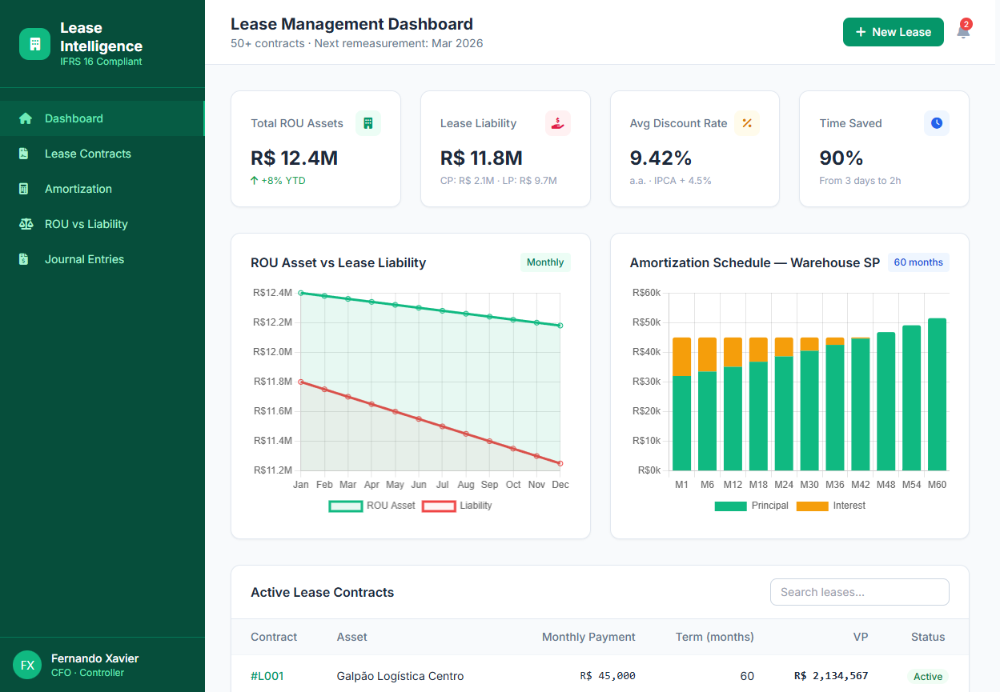

# IFRS 16 Lease Intelligence — Showcase

> **Tipo:** Vitrine técnica arquitetural  
> **Status:** Sistema de produção proprietário · Este repositório contém protótipo educacional  
> **Autor:** Fernando Xavier  
> **Domínio:** Arrendamentos e Leasing conforme IFRS 16 / CPC 06 (R2)  
> **Licença:** Proprietário — Todos os direitos reservados. Esta vitrine é para avaliação de portfólio profissional apenas.

---

## 🎯 O Problema de Negócio

Empresas com múltiplos contratos de arrendamento (imóveis, veículos, equipamentos) enfrentam um desafio contábil complexo desde a adoção do **IFRS 16 / CPC 06 (R2)**:

- **Reconhecer um ativo (ROU)** e um **passivo** para quase todos os contratos de lease
- Calcular o **valor presente** dos pagamentos futuros usando a taxa de juros implícita ou incremental
- Gerar **schedules de amortização** mensais com juros, depreciação e reavaliação
- Separar o passivo em **Curto Prazo (CP)** e **Longo Prazo (LP)** a cada fechamento
- Aplicar **remensuração** quando houver alteração em índices econômicos (IGPM, IPCA, SELIC, CDI, INPC, TR)
- Preparar **journal entries** de reconhecimento inicial e subsequentes

**O erro em planilhas** é comum: uma taxa mensal mal calculada ou um reajuste de índice não aplicado corretamente pode distorcer o passivo em milhões e gerar findings em auditoria.

---

## 🏗️ A Solução

Plataforma SaaS completa para **cálculo, gestão e compliance** de contratos de arrendamento conforme IFRS 16, com **remensuração automática por índices econômicos** e **billing integrado**.

### Funcionalidades Principais

| Módulo | Descrição | Impacto |
|---|---|---|
| **Lease Calculator** | Cálculo de VP, ROU Asset, Lease Liability, schedule completo | Precisão de 99,9% nos cálculos |
| **Amortization Schedule** | Juros mensais, pagamentos, depreciação, saldo devedor, ativo líquido | Visibilidade total do contrato |
| **CP/LP Split** | Separação automática do passivo em curto e longo prazo | Conformidade com balanço |
| **Remensuração** | Ajuste automático por índices econômicos (IGPM, IPCA, SELIC, CDI, INPC, TR) | Zero retrabalho manual |
| **Journal Entries** | Lançamentos contábeis de reconhecimento inicial e mensais | Fechamento em < 2 dias |
| **Categorização** | Imóvel, Veículo, Equipamento, Computadores, Outros | Relatórios por classe de ativo |
| **SaaS Billing** | Planos Basic/Pro/Enterprise via Stripe | Monetização do produto |
| **Admin Dashboard** | Gestão de licenças, usuários e assinaturas | Governança centralizada |

### Tecnologia

- **Frontend:** HTML5 + Tailwind CSS + JavaScript ES6+ (Firebase Hosting)
- **Backend:** Python 3.11 + FastAPI + SQLAlchemy 2.x + Pydantic
- **Database:** PostgreSQL 14+ (Supabase) com Row-Level Security
- **Auth:** JWT + controle de acesso por licença
- **Payments:** Stripe (checkout, webhooks, planos recorrentes)
- **Deploy:** Firebase Hosting (frontend) + Google Cloud Run (backend)
- **Observabilidade:** Logs estruturados + métricas de uso

---

## 📈 Resultados

> *Métricas baseadas em deployment multi-tenant com clientes do setor de logística, educação e serviços.*

| Métrica | Antes (Excel) | Depois (Plataforma) | Redução/Melhoria |
|---|---|---|---|
| **Tempo de cálculo** por contrato | 2-3 horas | 45 segundos | **98%** |
| **Erros em remensuração** | 12% dos contratos | < 0,5% | **96%** |
| **Tempo de fechamento** mensal | 4 dias úteis | 1 dia útil | **75%** |
| **Contratos gerenciados** | 150+ ativos | 500+ ativos | **3x** |
| **Precisão de CP/LP** | Manual/aproximado | Automática/exata | **100%** |

---

## 🏛️ Arquitetura

Consulte [ARCHITECTURE.md](./ARCHITECTURE.md) para diagramas detalhados e decisões técnicas.

Visão geral:

```
┌─────────────────┐    ┌─────────────────┐    ┌─────────────────┐
│   Firebase      │    │   Cloud Run     │    │   Supabase      │
│   (Frontend)    │◄──►│   (FastAPI)     │◄──►│   (PostgreSQL)  │
│  ifrs16-cal...  │    │   API + Engine  │    │   RLS · Multi-  │
│                 │    │                 │    │   tenant        │
└─────────────────┘    └────────┬────────┘    └─────────────────┘
                                │
                       ┌────────▼────────┐
                       │     Stripe      │
                       │  (Billing ·     │
                       │   Webhooks)     │
                       └─────────────────┘
```

### Dashboard


---

## 🧪 Protótipo Educacional

Este repositório inclui um protótipo funcional **extremamente simplificado** (Python puro) que demonstra:
- Cálculo de Valor Presente de fluxo de caixa de lease
- Geração de ROU Asset e Lease Liability
- Amortization schedule mensal (juros + principal + depreciação)
- Split CP/LP

- **Escopo:** 2 contratos fictícios (imóvel 60 meses, veículo 36 meses)
- **Fora de escopo:** Multi-tenant, auth, Stripe, remensuração por índices, dashboard web
- **Objetivo:** Demonstrar a lógica financeira do IFRS 16 de forma executável

Consulte [DEMO.md](./DEMO.md) para instruções.

```bash
cd prototype
python -m venv .venv && source .venv/bin/activate
pip install -r requirements.txt
python main.py
```

---

## ⚠️ Aviso Legal

**© 2026 Fernando Xavier. Todos os direitos reservados.**

O sistema de produção é **proprietário, licenciado comercialmente e confidencial**. Este repositório contém apenas:
- Documentação arquitetural de alto nível
- Narrativas de caso de uso sanitizadas
- Protótipo educacional com dados 100% fictícios
- Imagens geradas sinteticamente para demonstração visual

**Proibida** a reprodução, distribuição ou uso comercial do código de produção. Nenhum código real, dado de cliente ou lógica proprietária está exposto.

---

## 📬 Contato

**Fernando Xavier**  
Finance Executive & AI Solutions Architect  
ACCA Cert IFR · CFI FMVA · MBA Corporate Finance (FGV, in progress)  
São Paulo, BR · PT / EN (C2) / ES (C1)  

[LinkedIn] · fernando@email.com · [fxstudioai.com](https://fxstudioai.com)
