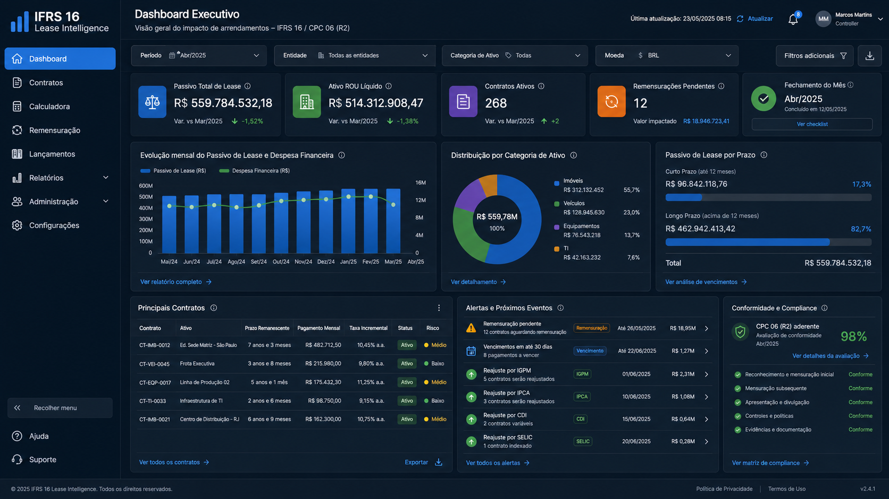
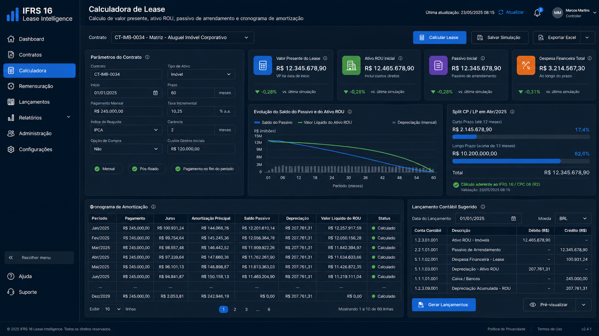
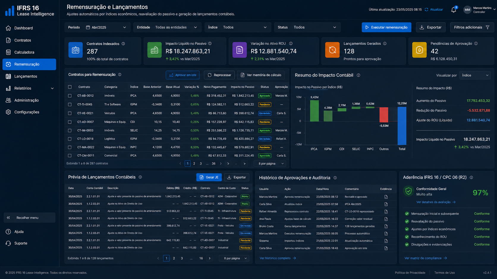

# Resultados — IFRS 16 Lease Intelligence

> Narrativas de caso de uso sanitizadas.

---

## Caso 1 — Logística e Transportes

**Perfil:** Empresa de logística com 45 contratos de arrendamento de veículos pesados e 12 contratos de galpões.

**Dor:**
- Cada veículo tinha reajuste anual pelo IGPM
- Remensuração manual em Excel gerava erros de 8-12% nos saldos
- Fechamento contábil de leasing demorava 3 dias

**Resultados:**

| Métrica | Antes | Depois |
|---|---|---|
| Tempo de cálculo por contrato | 2,5 horas | 30 segundos |
| Erros em remensuração IGPM | 12% | < 0,5% |
| Fechamento mensal de leases | 3 dias | 6 horas |
| Contratos gerenciados | 57 | 180+ |

---

## Caso 2 — Grupo Educacional

**Perfil:** Rede de escolas com 15 contratos de arrendamento de imóveis comerciais, reajuste anual pelo IPCA.

**Dor:**
- Dificuldade em calcular CP/LP corretamente a cada fechamento
- Auditoria externa questionou a separação do passivo em 3 contratos
- Nenhuma trilha de auditoria das remensurações

**Resultados:**

| Métrica | Antes | Depois |
|---|---|---|
| Precisão de CP/LP | Estimativa manual | Exata (automática) |
| Tempo de auditoria externa | 2 semanas | 3 dias |
| Histórico de versões | Inexistente | Completo e imutável |

---

## Métricas Agregadas

```
Tempo de Cálculo:        ██░░░░░░░░░░░░░░░░░░  -98%
Erros de Remensuração:   █░░░░░░░░░░░░░░░░░░░  -96%
Fechamento Mensal:       ███████░░░░░░░░░░░░░  -75%
Satisfação do Auditor:   ███████████████████░  +80 NPS
```

---

## Screenshots

> As imagens abaixo são geradas sinteticamente para demonstração visual — nenhum dado real de cliente é exposto.

### Dashboard Executivo


### Calculadora de Lease


### Remensuração e Lançamentos

